Este documento tiene como propósito proporcionar a un usuario externo una guía exhaustiva que muestre el procedimiento a
seguir para desplegar y visualizar el programa en un ambiente local. En este plan de
despliegue, se detallan todos los requisitos necesarios, así como los comandos y pasos
específicos que se deben ejecutar para correr la página web de manera exitosa.

# 1. Prerrequisitos:

Esta es una pagina de inicio para Creze. Fue construida con Django y React principalmente. Dentro de esta documentación,
cada que se menciona el uso de una terminal se está usando Windows Powershell. Si usas MacOS o algún distro basado en
Linux, visita la sección Instalación en MacOs o Linux.

## Instalar Python 3.11 o superior (versión recomendada)

Visita el sitio oficial de Python y ve a la [sección de descargas](https://www.python.org/downloads/). Dentro de dicha
sección podrás encontrar las versiones 3.11 o 3.12 de Python para poder correr el proyecto.

## Instalar Node.js y NPM

Dentro del sitio oficial de [Node JS](https://nodejs.org/en/) podrás encontrar la versión 22 LTS, misma que fue usada
para este proyecto.

# 2. Descarga del repositorio y modo de uso.

En la parte superior de esta página está el botón de `Code`. Ahí se puede tanto clonar o descargar el repositorio. Se
recomienda descargar la carpeta comprimida (en zip) y después extraer los archivos.

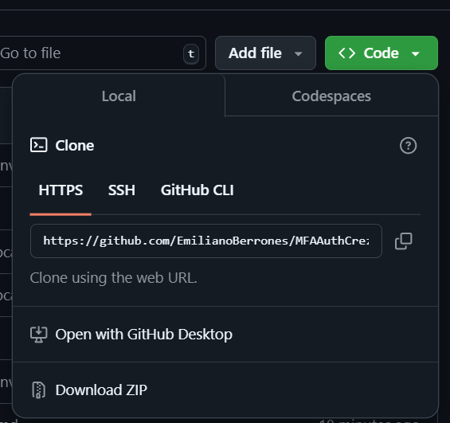

# 3. Instalación de un entorno virtual local

Una vez descargado el proyecto y las herramientas necesarias se necesita crear un entorno virtual dentro del equipo para
poder ejecutar la página. Crear un entorno virtual ayuda a aislar las versiones usadas dentro de un programa, y evita
contaminar el entorno global. Primero hay que ubicarse en la carpeta principal del proyecto. Con cualquier editor de
código, al abrir la terminal se debería de ubicar dentro de la carpeta, pero si no es el caso has los siguientes pasos:

1. Abre la terminal del sistema
   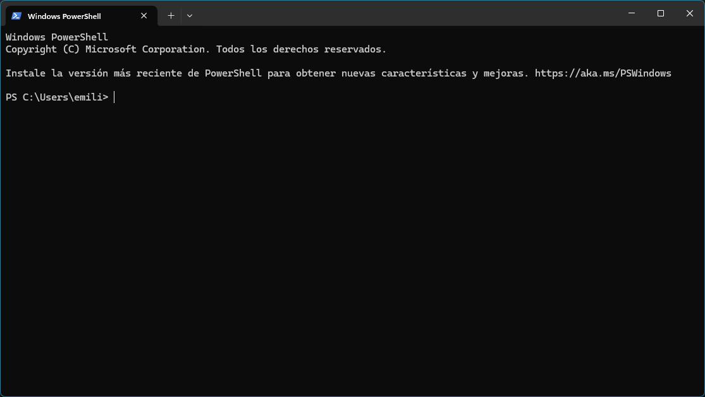
2. Usa cd para ubicarte en la carpeta del proyecto
   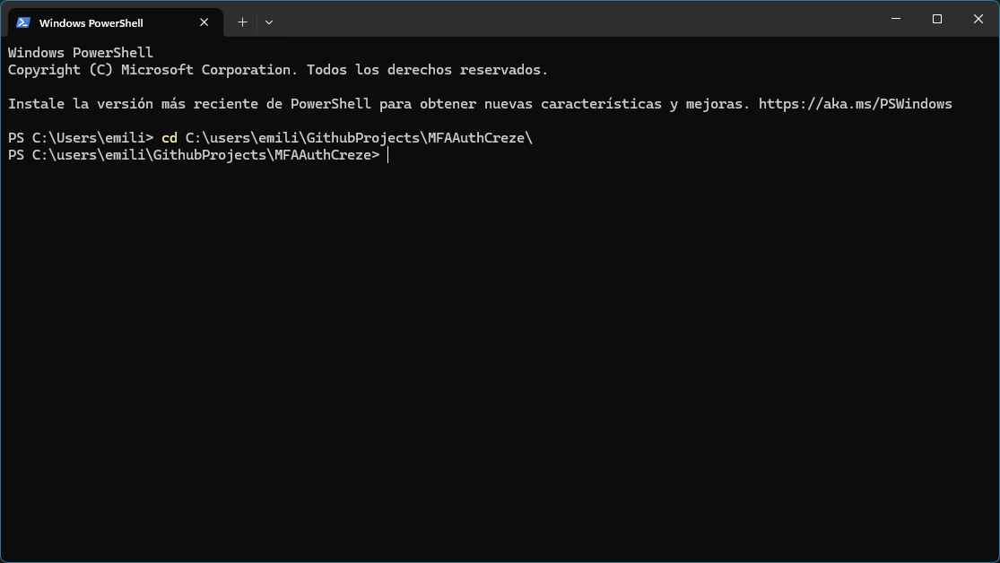
3. Usa el comando: `python -m venv venv` en Windows, o el comando `python3 -m venv venv`, para crear el entorno virtual.
   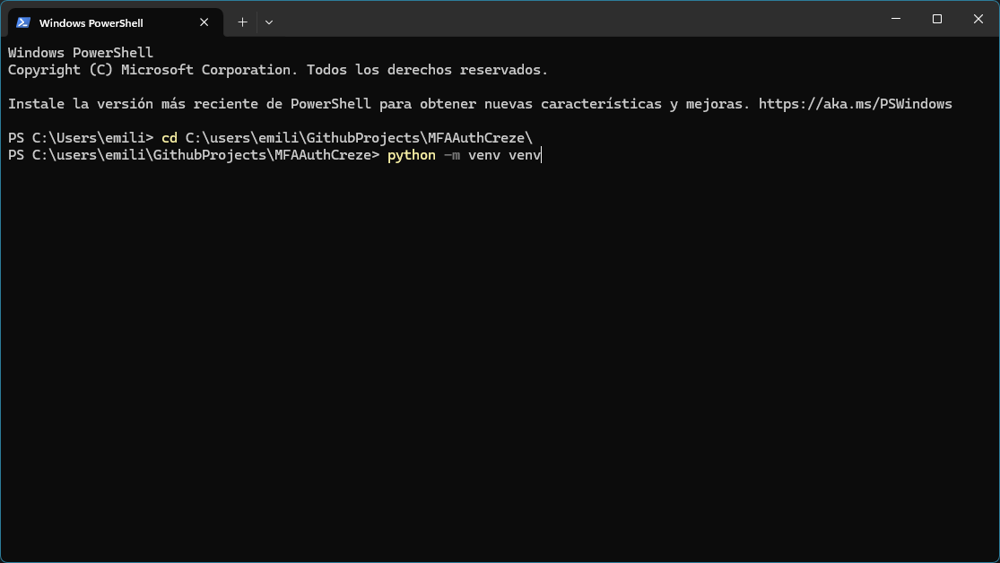

## Instalar dependencias dentro del proyecto

Es importante primero localizarse dentro del entorno virtual que acabamos de crear. Usa las instrucciones del paso
anterior para lograrlo. Una vez estemos dentro de la carpeta principal, se ejecuta el comando `.\venv\Scripts\activate`
en Windows, o en MacOS o Linux el comando es `source venv/bin/activate`. Sabremos que el entorno virtual se ha activado
por el texto `(venv)` que aparece a la izquierda.
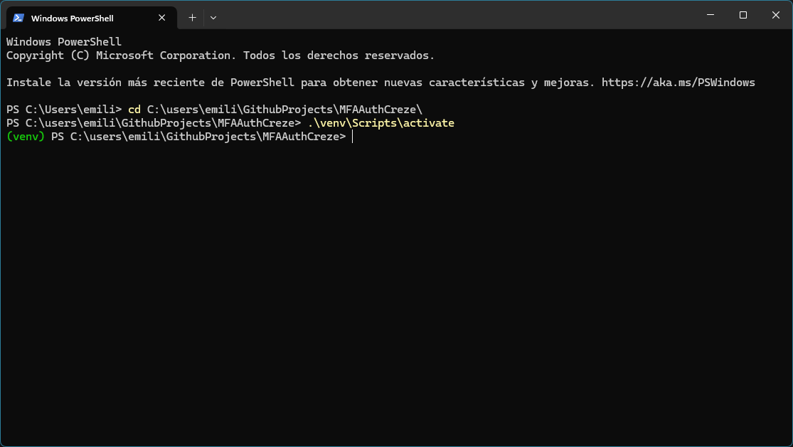

### Backend

Una vez activado el entorno virtual se pueden instalar las dependencias del proyecto. Para facilitar el proceso he
creado un archivo con las dependencias necesarias dentro del backend. Para instalarlos:

1. Ubícate en la carpeta `backend` del proyecto usando `cd backend`
2. Ejecuta el comando `pip install -r dependencias.txt`
   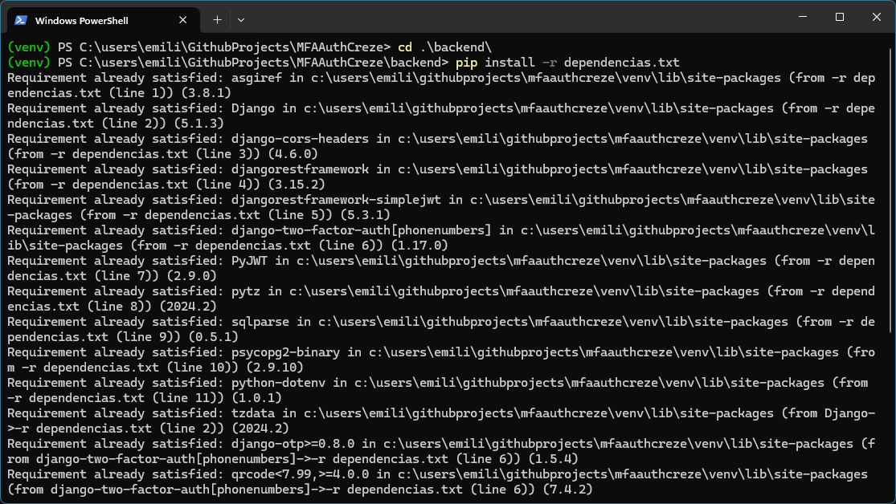

### Frontend

Para instalar las dependencias necesarias del frontend del proyecto hay que seguir un proceso similar al anterior:

1. Ubícate en la carpeta `frontend` del proyecto usando `cd frontend`
2. Hay un archivo .txt llamado `dependencias.txt`. Ábrelo y ejecuta `npm install` por cada dependencia.
   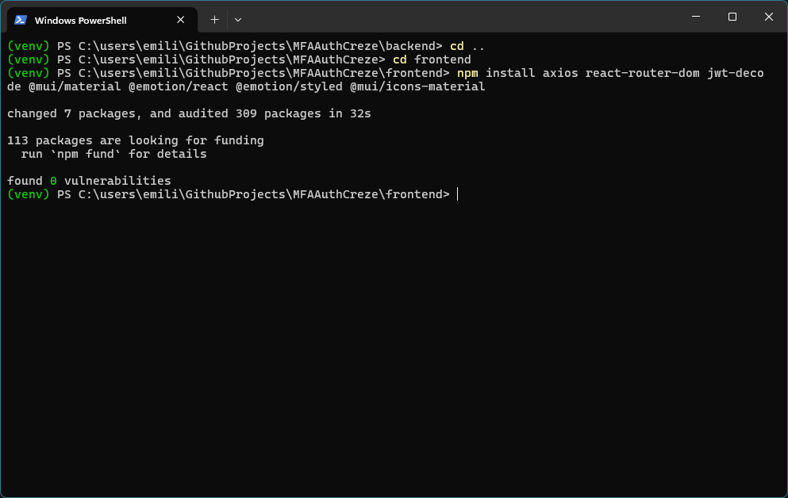

# 4. Visualizar la página en el entorno local

Para visualizar la página localmente en el equipo, se deben de abrir dos terminales. Una para el backend y otra para el
frontend. En el backend se ejecuta el comando `python manage.py runserver`. Para el frontend se ejecuta el comando
`npm run dev`.
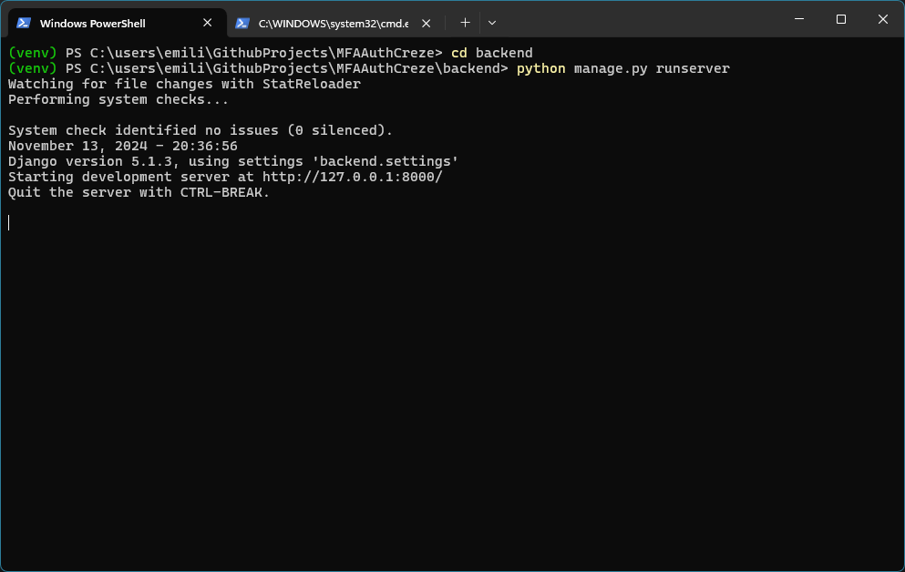
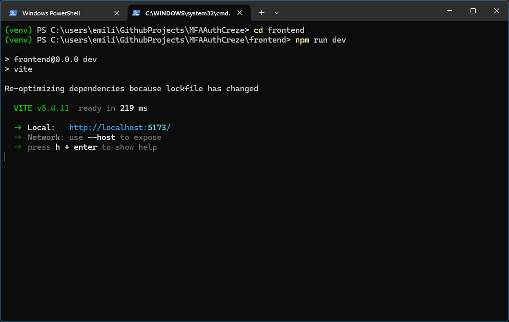

Posteriormente, hay que ir al vínculo indicado por la terminal del frontend. En mi caso es `http:localhost:5173/`. Se
muestra el inicio de sesión.
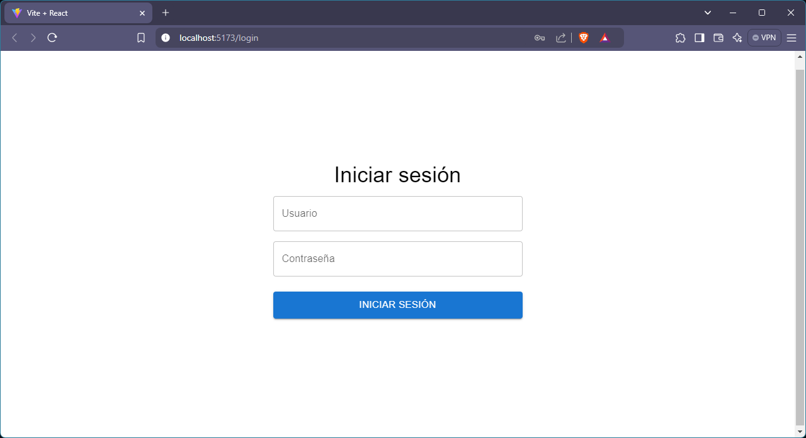

# 5. Funcionalidades que atiende el programa.

El proyecto es un inicio de sesión con 8 pantallas en total.

* Autenticación básica:
    * El sistema maneja tokens JWT para el manejo de sesiones
    * El sistema usa la autenticación de Django para inicio y cierre de sesión.
    * El sistema tiene funciones de registro, inicio de sesión y cierre de sesión.
* Autenticación multi-factor:
    * El sistema checa si el usuario tiene un dispositivo registrado para la autenticación de dos factores. Si no es el
      caso, le sugiere al usuario activarlo
    * El sistema maneja tokens JWT temporales para dichas pantallas en donde se registra el dispositivo con el TOTP.
    * El sistema muestra un código QR el cual se usa para activar la autenticación multi-factor.

# 6. Autores

[Emiliano Berrones](https://github.com/EmilianoBerrones)

# 7. Posibles problemas

En windows 11, es probable que la ejecución de scripts esté deshabilitada en el dispositvo. Sucede cuando al ejecutar un
comando se muestra lo siguiente:
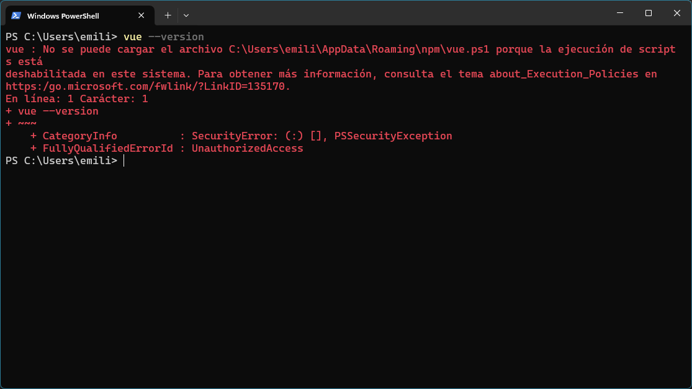
Para habilitar la ejecución de scripts dentro del equipo (y evitar que suceda este error) sigue los siguientes pasos:

1. Ejecuta el comando `Set-ExecutionPolicy RemoteSigned -Scope CurrentUser`, y selecciona Sí a todo (o presiona la
   tecla 'O').
   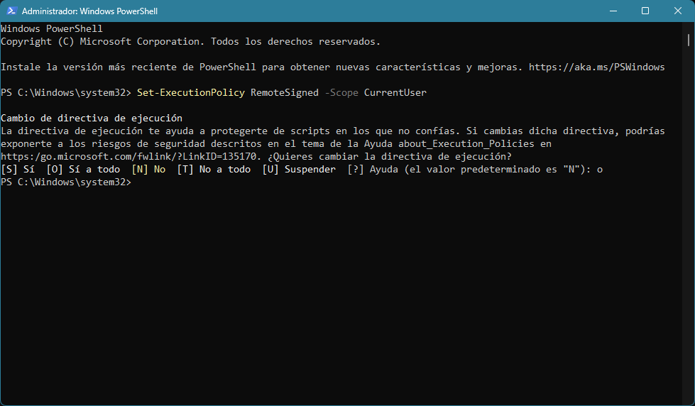
2. Comprueba que se modificaron los permisos ejecutando `Get-ExecutionPolicy -List`.
   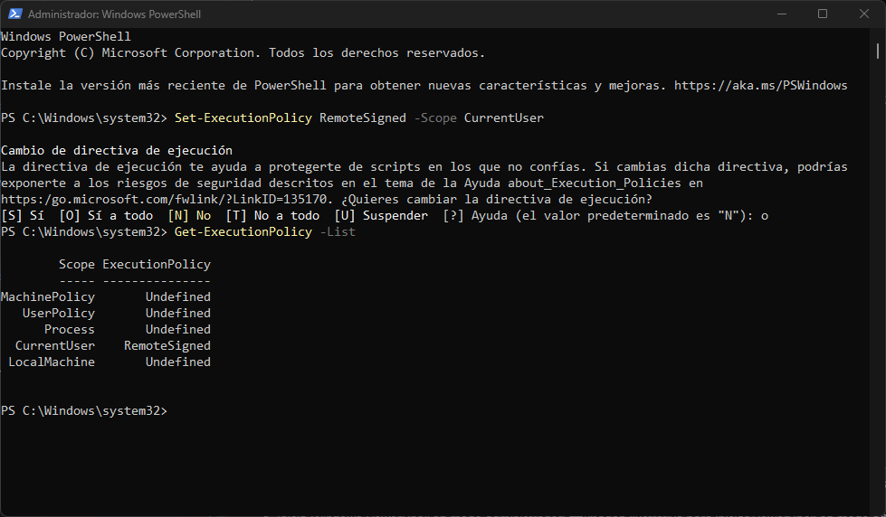
3. Cierra la ventana y vuelve a abrir _Windows PowerShell_. Intenta correr el script conflictivo de nuevo.